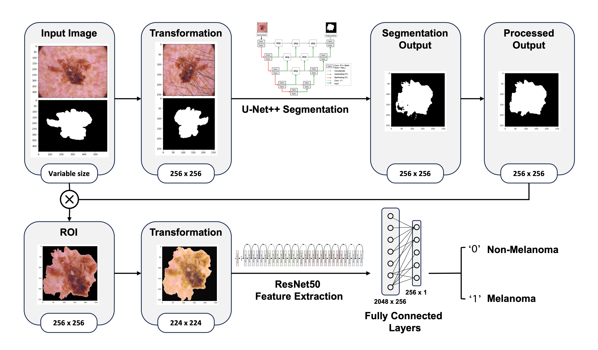

# Fusion of U-Net++ and ResNet50 Models for Melanoma Diagnosis from Dermoscopic Images

## Description

This repository presents a fusion model for skin lesion segmentation and classification, tailored for melanoma diagnosis from dermoscopic images. Combining a custom encoder-decoder neural network with a pre-trained classifier, the model achieves an overall accuracy of XX%. To enhance diagnostic precision, the model first extracts the Region of Interest (ROI) from lesion images using a U-Net++ inspired architecture before feeding the samples into a pre-trained ResNet50 model calibrated for binary predictions ('melanoma' or 'non-melanoma'). The workflow is trained and evaluated on the HAM10000 dataset, comprising 10,015 dermoscopic images with corresponding binary masks and gold standard malignant status annotations.

For more information please consult: [zell_CS502.pdf](https://github.com/KilianZell/zell_CS502/blob/9d2cbf271a5d6884695bdab75fc85b8895bf3aa5/zell_CS502.pdf)



## Getting Started

### Google Colab
This project was designed to run smoothly on Google Colab's free T4 GPU. If you wish to run it in Colab, download the [git repository](https://github.com/KilianZell/CS502_project.git) (~ Mo) and place it in your Google Drive. Load the data set following the instructions in the section `Data Loading`. Simply uncomment the appropriate cells in `main.ipynb` following the provided instructions and run the rest of the notebook.

### Installation
1. Download or clone the repository: `git clone https://github.com/KilianZell/CS502_project.git`
2. Manually install the required packages listed in requirements.txt. Alternatively, you can simply run the dedicated cell in `main.ipynb`.

### Data Loading
1. Download the compressed and assembled HAM10000 dataset:
   - For convenience, you can download the pre-compressed and assembled version directly from [HAM10000.zip](https://drive.google.com/file/d/1suJWzU8Oc4yJJraoR6ARsDSo-HFOFNmy/view?usp=share_link).
   - Alternatively, you have the option to manually reconstruct the dataset. (see section 'Manual Dataloading')
2. Place `HAM10000.zip` in the folder `data` (do not de-compress the .zip file, depending on the web browser you migth need to manually re-compress the file after dowloading)
3. Dowload the pre-trained models (only required if you wish to use the pre-trained functionalities):
   - [unet++.pt](https://drive.google.com/file/d/1biJqvAq1Vq8tWPM2E3ppaFDqp7iCzXhf/view?usp=share_link), the pretrained segmentation model
   - [resnet50.pt](https://drive.google.com/file/d/1H-3d_sALDrHNJXPizJFMPBZh09ty5gTK/view?usp=share_link), the pretrained classification model
4. Place the unzipped pre-trained models in the main directory

NOTE: If you wish to try metadata integation in part 3 (not tested) of the project you may also download [ISIC2019.zip](...).

### Run the Workflow
1. Make sure that your working directory looks like the one in the `Directory Structure` section.
2. Simply open the project notebook `main.ipynb`, configure your GPU availability in the dedicated cell, and run the rest of the cells while following the instructions.
   
### Directory Structure
Once installation and dataloading performed, your working directory should look like:
```bash
working directory/
├── data
│   └── HAM10000.zip
├── toolbox
│   ├── dataset.py
│   ├── models.py
│   ├── training.py
│   ├── utils.py
│   └── plots.py
├── figures
│   ├──  fig1.png
│   ├──  fig2.png
│   ├──  fig3.png
│   ├──  fig4.png
│   ├──  fig5.png
│   ├──  fig6.png
│   └──  fig7.png
├── main.ipynb
├── unet++.pt
├── resnet50.pt
├── zell_report.pdf
├── requirements.txt
└── README.md
```
### Notebook Organization
The notebook is structured into three main parts, each dedicated to a specific aspect of the project.

*Part 1: Lesion Segmentation.* The primary objective in this initial phase is to implement advanced image processing and machine learning techniques to achieve precise and reliable lesion segmentation from dermoscopic images. Evaluation will be conducted using various performance metrics, including the Dice coefficient and pixel-level accuracy.

*Part 2: Lesion Classification.* Building on the 'region of interest' extraction approach developed in the previous part, this section aims to predict lesion disease states, categorizing them as either 'melanoma' or 'non-melanoma.' Model performance evaluation will include key metrics such as accuracy, specificity, sensitivity, precision, and F1-score.

---Please note that the following section has been implemented successfully but has not undergone thorough testing. Therefore, you may choose to disregard this section entirely.---

*Part 3: Metadata Integration.* Extending the classification efforts, this section aims to incorporate additional available patient metadata (age, lesion location, and sex). Model performance will be evaluated using key metrics such as accuracy, specificity, sensitivity, precision, and F1-score.

### Manual Dataloading
If you wish to manually download the HAM10000 dataset, you can follow this steps:
-  Download the two image folders and the groundtruth folder from the [Harvard Dataverse](https://dataverse.harvard.edu/dataset.xhtml?persistentId=doi:10.7910/DVN/DBW86T):
         - `HAM10000_images_part_1.zip`
         - `HAM10000_images_part_1.zip`
         - `HAM10000_segmentations_lesion_tschandl.zip`
      -  Download the groundtruth labels .csv file from the [ISIC website](https://challenge.isic-archive.com/data/#2018) available at this [link](https://isic-challenge-data.s3.amazonaws.com/2018/ISIC2018_Task3_Training_GroundTruth.zip).
      -  After downloading:
         - Unzip all files
         - Compile the two image folders into a single folder named `data_train`
         - Rename the groundtruth folder to `gt_train'`
         - Rename the .csv label file to `gt_train.csv`
         - Group `data_train`, `gt_train` and `gt_train.csv` in a folder called `HAM10000` and compress it
         - Place `HAM10000.zip` in the folder named `data`


