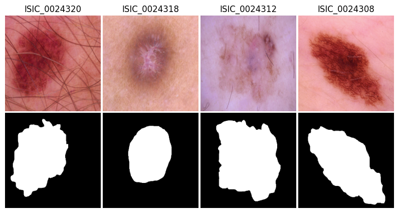

# Fusion of U-Net++ and ResNet50 Models for Melanoma Diagnosis from Dermoscopic Images

## Getting Started

### Installation
1. Download or clone the repository: `git clone https://github.com/KilianZell/CS502_project.git`
2. Manually install the required packages listed in requirements.txt. Alternatively, you can simply run the dedicated cell in `main.ipynb`.

### Data Loading
1. Download the compressed and assembled HAM10000 dataset:
   - For convenience, you can download the pre-compressed and assembled version directly from [HAM10000.zip](https://drive.google.com/file/d/1suJWzU8Oc4yJJraoR6ARsDSo-HFOFNmy/view?usp=share_link).
   - Alternatively, you have the option to manually reconstruct the dataset. (see section 'Manual Installation')
2. Place `HAM10000.zip` in the folder `data` (do not de-compress the .zip file)
3. Dowload the pre-trained models (only required if you wish to use the pre-trained functionalities):
   - [unet++.pt](...), the pretrained segmentation model
   - [resnet50.pt](...), the pretrained classification model
4. Place the unzipped pre-trained models in the main directory.

### Run the workflow
1. Make sure that your working directory looks like the one in the `Directory Structure` section.
2. Simply open the project notebook main.ipynb and run the cells while following the instructions.
   
### Directory Structure
Once installation and dataloading performed, your working directory should look like:
```bash
working directory/
│
├── data/
│   └── HAM10000.zip/
│
├── toolbox/
│   ├── dataset.py/
│   ├── models.py/
│   ├── training.py/
│   ├── utils.py/
│   └── plots.py/
│
├── main.ipynb/
│
├── unet++.pt/
│
├── resnet50.pt/
│
├── figures/
│   ├──  fig1.png/
│   ├──  fig2.png/
│   ├──  fig3.png/
│   ├──  fig4.png/
│   ├──  fig5.png/
│   ├──  fig6.png/
│   └──  fig7.png/
│
├── README.md/
└── requirements.txt/
```

### Manual Dataloading
If you wish to manually download the HAM10000 dataset, you can follow the following steps:
-  Download the two image folders and the groundtruth folder from the [Harvard Dataverse](https://dataverse.harvard.edu/dataset.xhtml?persistentId=doi:10.7910/DVN/DBW86T):
         - `HAM10000_images_part_1.zip`
         - `HAM10000_images_part_1.zip`
         - `HAM10000_segmentations_lesion_tschandl.zip`
      -  Download the groundtruth labels .csv file from the [ISIC website](https://challenge.isic-archive.com/data/#2018) available at this [link](https://isic-challenge-data.s3.amazonaws.com/2018/ISIC2018_Task3_Training_GroundTruth.zip).
      -  After downloading:
         - Unzip all files
         - Compile the two image folders into a single folder named `data_train`
         - Rename the groundtruth folder to `gt_train'`
         - Rename the .csv label file to `gt_train.csv`
         - Group `data_train`, `gt_train` and `gt_train.csv` in a folder called `HAM10000` and compress it.
         - Place HAM10000 in the data folder.
       
## Description

This repository presents a fusion model for skin lesion segmentation and classification, tailored for melanoma diagnosis from dermoscopic images. Combining a custom encoder-decoder neural network with a pre-trained classifier, the model achieves an overall accuracy of XX%. To enhance diagnostic precision, the model first extracts the Region of Interest (ROI) from lesion images using a U-Net++ inspired architecture before feeding the samples into a pre-trained ResNet50 model calibrated for binary predictions ('melanoma' or 'non-melanoma'). The workflow is trained and evaluated on the HAM10000 dataset, comprising 10,015 dermoscopic images with corresponding binary masks and gold standard malignant status annotations.


## Introduction
Skin cancer is the most prevalent type of cancer, and while melanoma constitutes only around 1\% of them, it is responsible for the majority of skin cancer-related death.\cite{american} Currently, melanoma diagnoses rely primarily on the visual examination of skin lesions by dermatologists.\cite{davis19} Unfortunately, this kind of diagnosis is prone to subjectivity and errors.\cite{grant99}  This significantly impact patients' well-being, as an early-stage misdiagnosis can substantially diminish overall chances of survival.

In this context, deep learning has the potential to significantly enhance the consistency and accuracy of diagnosis while remaining entirely non-invasive. In this work, a model specifically designed to classify skin lesions as 'melanoma' or 'non-melanoma' is proposed. In unsegmented dermoscopic images, the borders of a lesion and skin texture can lead to unwanted feature extraction, affecting the overall performance of classification. To overcome this challenge, the proposed model first extract the Region of Interest (ROI) form the input image using a U-Net++ inspired model so that only relevant features are considered for diagnosis. The resulting segmented region is then fed into a pre-trained ResNet50 calibrated for binary classification to obtain the final prediction.(see Fig. 2)

The entire workflow is trained and evaluated using the HAM10000\cite{tschandl18}  data-set, consisting of 10'015 dermoscopic images along with their corresponding binary mask images and entries indicating gold standard malignant status.




